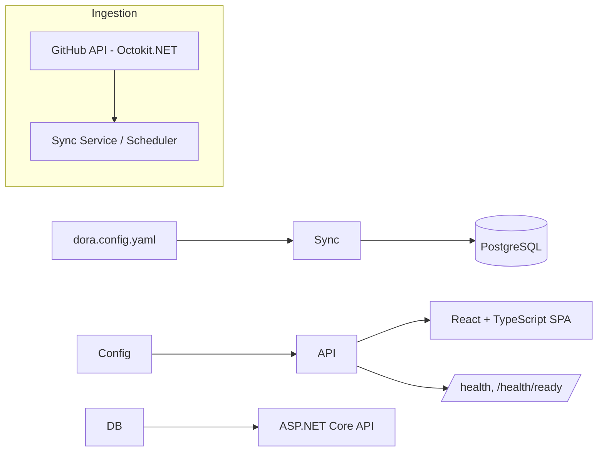

# DORA Metrics Dashboard

A self-hosted dashboard that computes the four [DORA metrics](https://dora.dev/) — deployment
frequency, lead time for changes, change failure rate, and mean time to recovery — from GitHub
activity, for one or more teams. Everything it tracks (repos, team groupings, how deployments and
incidents are detected) is driven by a single config file, not hardcoded to one org's setup.

!\[DORA Metrics Dashboard screenshot](docs/screenshot.png)

## Why

Engineering leadership tools that surface these metrics (Sleuth, LinearB, Jellyfish) exist because
teams consistently want this data and don't want to build it themselves. This is a from-scratch,
self-hosted take on the same idea — built the way an internal platform team would build it, not as
a one-off script.

## Architecture



* **`src/Core`** — domain entities, EF Core `DbContext`, and the metric calculators (pure,
independently testable strategy classes behind `IMetricCalculator`).
* **`src/Ingestion`** — the GitHub client (Octokit, wrapped behind `IGitHubClient` so it's
mockable) and the sync service, which both the API's `POST /api/sync` and a background
scheduler call.
* **`src/Api`** — ASP.NET Core Minimal API: metrics endpoints, health checks, OpenTelemetry,
Serilog, CORS for the SPA.
* **`web`** — React + TypeScript (Vite) dashboard that calls the API over REST.

See [`docs/adr/0001-metric-definitions-and-stack-choice.md`](docs/adr/0001-metric-definitions-and-stack-choice.md)
for exactly how each metric is defined and why, including the simplifying assumptions worth
knowing about.

## Quickstart

```bash
# 1. Start Postgres
docker compose up -d

# 2. Configure which repos/teams to track
#    Edit src/Api/dora.config.yaml (defaults to a placeholder repo)

# 3. Create the database schema (first time only, after adding an EF Core migration)
dotnet tool install --global dotnet-ef   # once, if you don't have it
dotnet ef database update --project src/Core --startup-project src/Api

# 4. Run the API
dotnet run --project src/Api

# 5. Run the dashboard
cd web
cp .env.example .env.local   # points the SPA at the local API
npm install
npm run dev
```

Optionally set `GitHub:Token` (an `appsettings.Development.json` override, or the
`GitHub\_\_Token` environment variable) to a personal access token to avoid GitHub's unauthenticated
rate limit.

## Tech stack

|Layer|Choice|
|-|-|
|Backend|.NET 8, ASP.NET Core Minimal API|
|Database|PostgreSQL + EF Core|
|GitHub access|Octokit.NET, wrapped behind `IGitHubClient`|
|Resilience|Polly (retry with backoff on GitHub calls)|
|Frontend|React + TypeScript, Vite|
|Observability|Serilog (structured logs), OpenTelemetry (traces + metrics)|
|Testing|xUnit; Testcontainers for a real Postgres in integration tests|
|CI|GitHub Actions — separate jobs for the .NET and web builds|

## Status

Phase 0 scaffold: solution structure, entities, metric calculators (with unit tests), the GitHub
ingestion path, API endpoints, and a minimal working dashboard UI are in place. Not yet done: an
EF Core migration committed to the repo (run `dotnet ef migrations add InitialCreate` once you can
reach NuGet and a Postgres instance), and the richer trend-chart UI. See the build plan for the
full phased roadmap.

## Repo structure

```
/src
  /Api          — ASP.NET Core Minimal API
  /Core         — domain model + metric calculator strategies
  /Ingestion    — GitHub client + sync service
/web            — React + TypeScript SPA (Vite)
/tests
  /Core.Tests   — unit tests for the metric calculators
  /Api.Tests    — API integration tests (Testcontainers + Postgres)
/docs/adr       — architecture decision records
docker-compose.yml
.github/workflows/ci.yml
```

